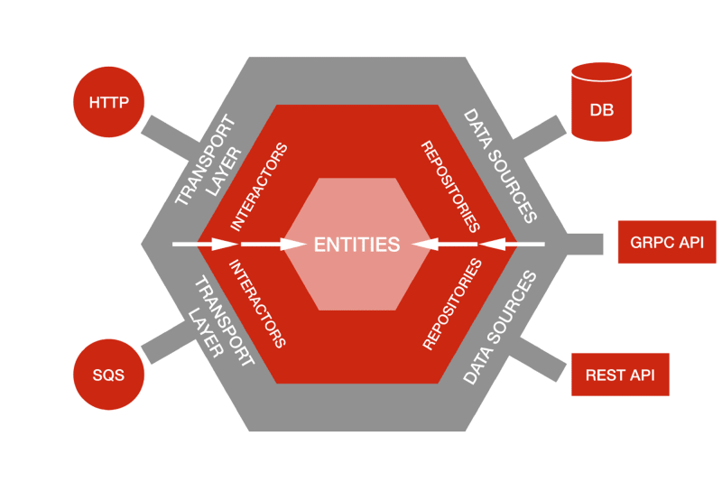

# QBank

## Visão Geral do Projeto

O projeto QBank tem como objetivo desenvolver uma aplicação bancária moderna e eficiente. Nossa equipe está comprometida em criar uma solução robusta e escalável para gerenciamento de contas bancárias.

## Integrantes do Grupo

- Agda da Silva Cavalcanti (https://github.com/Agda-Cavalcanti)
- Gabriel da Silva Oliveira Costa (https://github.com/GabrielCosta-99)
- Lucas Fonseca Rosa Magalhães (https://github.com/lucasfonsecarosamagalhaes)
- Luiz Gustavo Domingues Lacerda (https://github.com/Luiz-Gustavo-D-Lacerda)
- Pedro Tonidandel Mansur 12310667 (https://github.com/PedroTMansur)

## Tecnologias Utilizadas

- ASP.NET Core (C#)
- Entity Framework Core
- SQL Server
- HTML/CSS/JavaScript (para a interface web)
- Angula 

## Arquitetura Hexagonal 

A arquitetura hexagonal, também conhecida como arquitetura de portas e adaptadores, vem do trabalho de Alistair Cockburn. É um jeito de estruturar aplicativos de software. Nela, as entradas e saídas ficam na borda do projeto, o que ajuda a separar a lógica principal do aplicativo do ambiente externo. Como as entradas e saídas estão na borda, podemos mudar os manipuladores sem impactar o código principal. Em resumo, é uma maneira de organizar o código em camadas, cada uma com sua função, com o objetivo de manter a lógica da aplicação isolada do mundo externo.

**como ela funciona?**

A arquitetura hexagonal funciona como um adaptador de carregador. Imagine que você tem um carregador que só funciona com tomadas do Brasil. Quando você viaja para a Europa, as tomadas são diferentes, e você precisa de um adaptador.

Na arquitetura hexagonal, a lógica principal do aplicativo é como o carregador: ela faz o trabalho, mas só entende um tipo de "entrada". As portas e adaptadores são como os adaptadores de tomada: eles permitem que o aplicativo se conecte a diferentes entradas e saídas (como banco de dados, APIs ou interface do usuário) sem mudar a lógica central.

Assim, se você quiser mudar a forma como aplicativo recebe dados (como trocar de uma API para um banco de dados), você só precisa trocar o adaptador, e a lógica principal permanece a mesma, funcionando como sempre. Isso facilita a manutenção e a atualização do software.

**Camadas**

- Camada de Domínio: Essa é a lógica principal do aplicativo, como o carregador em si. Ele faz o trabalho de carregar o dispositivo, contendo as regras e funcionalidades centrais.

- Camada de Aplicação: Essa camada atua como o adaptador que conecta o carregador à tomada. Ela gerencia a comunicação entre a lógica do carregador e o tipo de tomada, garantindo que tudo funcione corretamente.

- Camada de Infraestrutura: Aqui estão as conexões com o mundo externo, como as tomadas e cabos. Essa camada é responsável por se conectar a diferentes tipos de entradas e saídas, permitindo que o carregador funcione em vários países.

**porque ela seria a melhor escolha:**

A arquitetura hexagonal é especialmente vantajosa para um aplicativo bancário porque isola a lógica de negócios das interfaces externas, garantindo segurança e integridade. Essa separação facilita testes, permitindo que a lógica do banco seja avaliada sem interferências das entradas e saídas. Além disso, ela oferece flexibilidade para mudanças, possibilitando a troca de adaptadores para novas interfaces ou serviços sem impactar a lógica principal. Por fim, à medida que o banco cresce, a arquitetura hexagonal permite adicionar funcionalidades e integrar novos sistemas de forma escalável, tornando-se uma escolha robusta em comparação com MVP e DDD.

## Pastas 

** Dominio**
 
** Aplicação**

- serviços ( pasta)

** Arquitetura Hexagonal**

tes